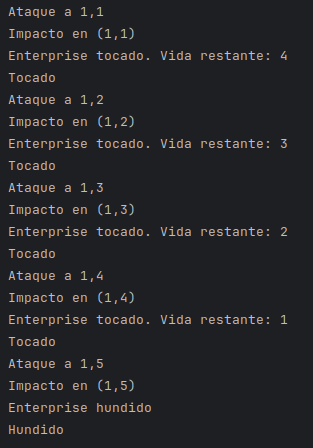
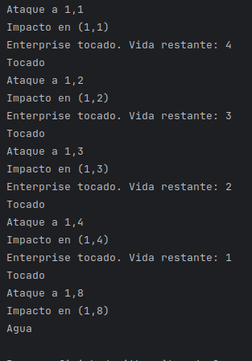
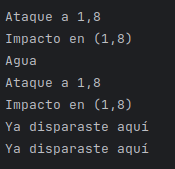

El objetivo del codigo es que funcione el juego de hundir la flota funcione, realizando ataques a un tablero 10x10, y se hindique si un barco a sido tocado, hundido, o agua

Juego: Controla los ataques que realiza el usuario y muestra el resultado de las acciones

Tablero: Tiene el conjunto de casillas y gestiona los impactos

Casilla: Guarda si una casilla ya fue atacada o si hay una nave

Nave: Contiene el estado de los barcos

El resultado de un disaro puede ser:

Agua: No hay nave

Tocado: Daño en la nave

Hundido: Nave destruida

Visitada: Casilla ya atacada

Aquí tenemos el ejemplo funcional:

